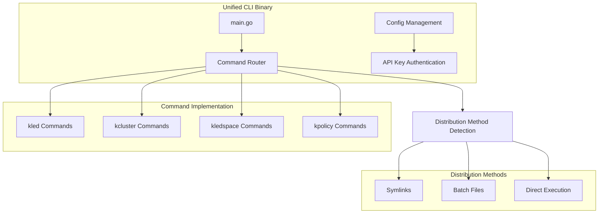
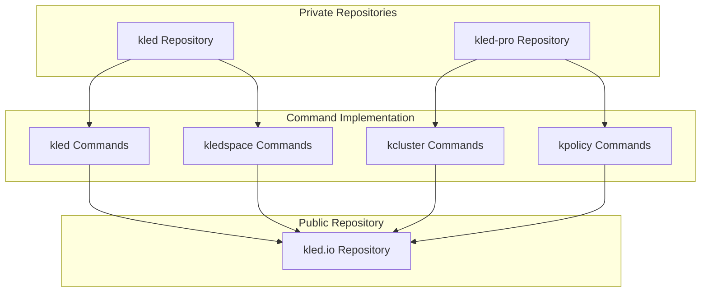
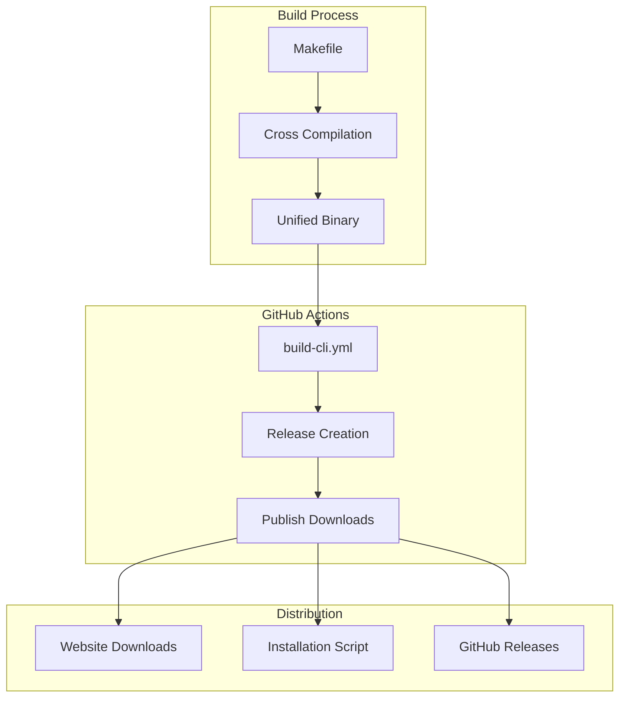
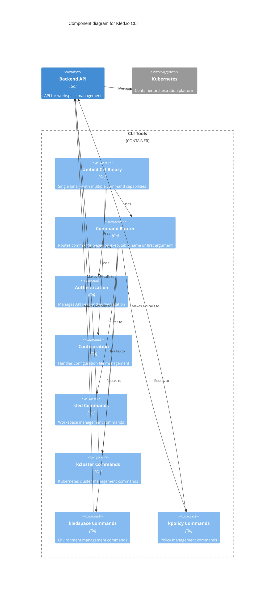

# CLI Integration Architecture

## Overview

The Kled.io CLI integration architecture describes how the various command line tools (kled, kcluster, kledspace, kpolicy) are implemented, integrated, and distributed across the repositories. This document outlines the unified CLI approach, command implementation locations, and the build and distribution process.

## Unified CLI Approach



### Command Implementation Locations



## Build and Distribution Process



## C4 Model: Component Level



## Implementation Details

### Unified CLI Binary

The unified CLI binary is implemented in the kled.io repository and serves as the entry point for all CLI commands. It determines which command to execute based on:

1. The executable name (e.g., `kled`, `kcluster`)
2. The first argument if executed as the unified binary (e.g., `kled-linux-amd64 kled`)

```go
func main() {
    execName := filepath.Base(os.Args[0])
    execName = strings.TrimSuffix(execName, filepath.Ext(execName))

    var command string
    if strings.HasPrefix(execName, "kled-") {
        if len(os.Args) < 2 {
            printUsage()
            os.Exit(1)
        }
        command = os.Args[1]
        os.Args = append(os.Args[:1], os.Args[2:]...)
    } else {
        switch execName {
        case "kled":
            command = "kled"
        case "kcluster":
            command = "kcluster"
        case "kledspace":
            command = "kledspace"
        case "kpolicy":
            command = "kpolicy"
        default:
            fmt.Printf("Unknown command: %s\n", execName)
            printUsage()
            os.Exit(1)
        }
    }

    // Execute the appropriate command
    switch command {
    case "kled":
        executeKled()
    case "kcluster":
        executeKCluster()
    case "kledspace":
        executeKledSpace()
    case "kpolicy":
        executeKPolicy()
    default:
        fmt.Printf("Unknown command: %s\n", command)
        printUsage()
        os.Exit(1)
    }
}
```

### Authentication and Configuration

The CLI tools use a shared authentication and configuration system that manages API keys and server URLs:

```go
type Auth struct {
    APIKey     string    `json:"apiKey"`
    APIBaseURL string    `json:"apiBaseURL"`
    CreatedAt  time.Time `json:"createdAt"`
}

func LoadAuth() (*Auth, error) {
    configPath, err := getConfigPath()
    if err != nil {
        return nil, err
    }

    if _, err := os.Stat(configPath); os.IsNotExist(err) {
        return nil, errors.New("no authentication configuration found")
    }

    data, err := os.ReadFile(configPath)
    if err != nil {
        return nil, err
    }

    var auth Auth
    if err := json.Unmarshal(data, &auth); err != nil {
        return nil, err
    }

    // Environment variables take precedence
    if apiKey := os.Getenv("KLED_API_KEY"); apiKey != "" {
        auth.APIKey = apiKey
    }
    if apiBaseURL := os.Getenv("KLED_API_BASE_URL"); apiBaseURL != "" {
        auth.APIBaseURL = apiBaseURL
    }

    return &auth, nil
}
```

### Distribution Methods

The CLI tools can be distributed and executed in several ways:

1. **Symlinks**: On Unix-like systems, symlinks to the unified binary allow execution as individual commands
2. **Batch Files**: On Windows, batch files route commands to the unified binary
3. **Direct Execution**: The unified binary can be executed directly with the command as the first argument

## GitHub Actions Workflow

The GitHub Actions workflow automates the build and distribution process:

```yaml
name: Build and Release CLI Tools

on:
  push:
    branches: [main]
    tags: ['v*']
  workflow_dispatch:

jobs:
  build:
    name: Build CLI Tools
    runs-on: ${{ matrix.os }}
    strategy:
      fail-fast: false
      matrix:
        os: [ubuntu-latest, macos-latest, windows-latest]
        include:
          - os: ubuntu-latest
            platform: linux
            arch: amd64
          - os: macos-latest
            platform: darwin
            arch: amd64
          - os: windows-latest
            platform: windows
            arch: amd64

    steps:
      - name: Checkout code
        uses: actions/checkout@v3

      - name: Set up Go
        uses: actions/setup-go@v4
        with:
          go-version: '1.21'

      - name: Build unified CLI binary
        run: |
          mkdir -p bin
          GOOS=${{ matrix.platform }} GOARCH=${{ matrix.arch }} go build -o bin/${{ matrix.artifact_name }} ./cli/unified
```

## Installation Script

The installation script simplifies the installation process for end users:

```bash
#!/bin/bash
set -e

TOOL="unified"
INSTALL_DIR="/usr/local/bin"
VERSION="latest"

# Download the appropriate binary
curl -fsSL "https://kled.io/download/${FILENAME}" -o "/tmp/$FILENAME"

# Install the binary
chmod +x "/tmp/$FILENAME"
sudo mv "/tmp/$FILENAME" "$INSTALL_DIR/$TOOL$EXTENSION"

# Create symlinks for individual commands
for SYMLINK in kled kcluster kledspace kpolicy; do
  sudo ln -sf "$INSTALL_DIR/$TOOL$EXTENSION" "$INSTALL_DIR/$SYMLINK$EXTENSION"
done
```

## Conclusion

The CLI integration architecture provides a unified approach to command line tools while maintaining separation between public and private repositories. The implementation details are kept in private repositories, while the public repository handles distribution and user-facing components.
