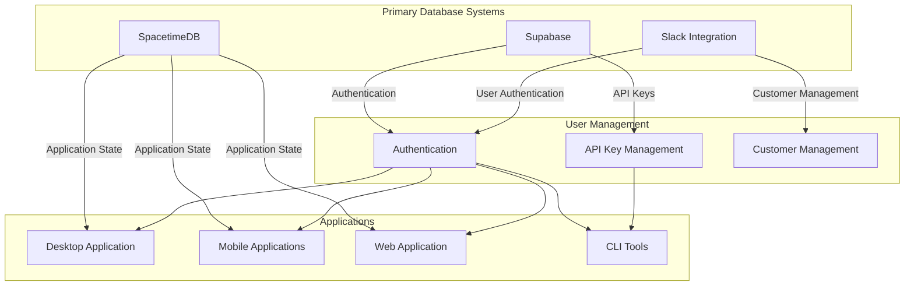
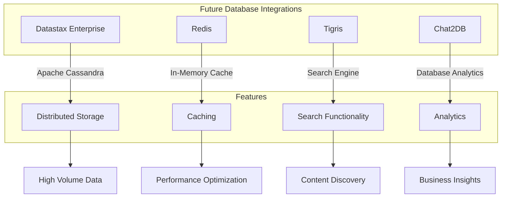
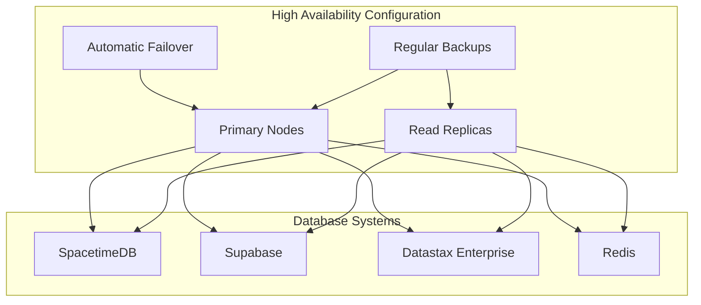
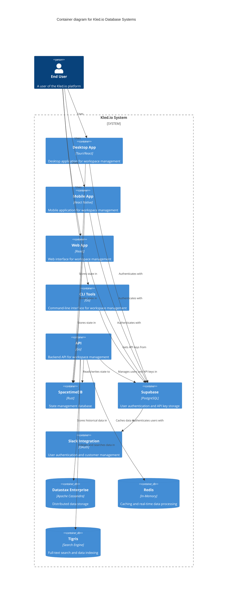
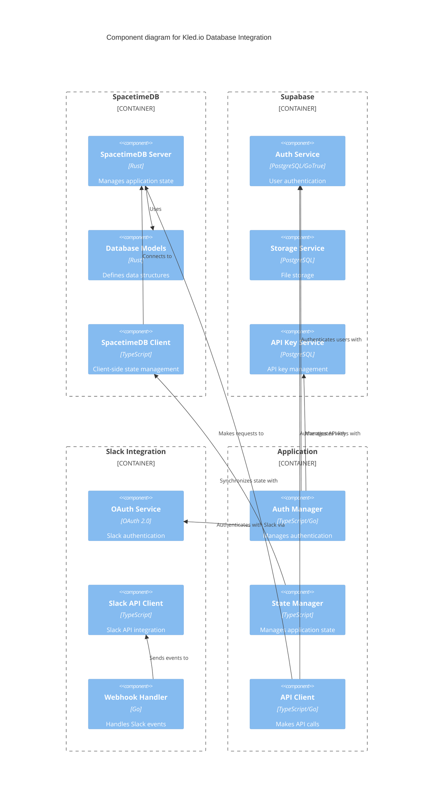

# Database Integration Architecture

## Overview

The Kled.io database integration architecture provides a comprehensive approach to data storage, state management, and high availability across the platform. This document outlines the primary database systems, future integrations, and high availability configurations.

## Primary Database Systems



### SpacetimeDB

SpacetimeDB serves as the primary state management database for the Kled.io platform:

- **Purpose**: Maintains application state across all platforms
- **Features**:
  - Real-time synchronization between clients
  - Rust-based database models
  - TypeScript client for frontend integration
  - Embedded server for desktop applications
- **Implementation**:
  - Runs as a server component in the Tauri desktop application
  - Provides a client library for web and mobile applications
  - Stores workspace configurations, user preferences, and application state

### Supabase

Supabase provides authentication and API key management:

- **Purpose**: User authentication and API key storage
- **Features**:
  - Self-hosted deployment option
  - Multiple authentication methods (email, OAuth)
  - Secure API key storage and management
  - PostgreSQL database backend
- **Implementation**:
  - Handles user registration and login
  - Manages API keys for CLI and API access
  - Provides user profile management

### Slack Integration

Slack integration provides additional authentication and customer management:

- **Purpose**: User authentication and customer tracking
- **Features**:
  - OAuth-based authentication
  - Automatic customer channel addition
  - User tracking and identification
- **Implementation**:
  - Authenticates users through Slack OAuth
  - Automatically adds users to the spectrumwebco.slack.com channel
  - Tracks user activity for customer management

## Future Database Integrations



### Datastax Enterprise (Apache Cassandra)

Datastax Enterprise will provide distributed data storage:

- **Purpose**: Scalable, distributed database for high-volume data
- **Features**:
  - Apache Cassandra-based distributed database
  - Linear scalability and fault tolerance
  - Multi-datacenter replication
  - Enterprise-grade security
- **Implementation**:
  - Stores historical data and analytics
  - Provides backup for critical application data
  - Enables cross-region data availability

### Redis

Redis will provide caching and real-time data processing:

- **Purpose**: High-performance caching and data processing
- **Features**:
  - In-memory data structure store
  - Pub/sub messaging
  - Lua scripting
  - Transaction support
- **Implementation**:
  - Caches frequently accessed data
  - Provides real-time messaging between components
  - Implements rate limiting and throttling

### Tigris

Tigris will provide search functionality and data indexing:

- **Purpose**: Full-text search and data indexing
- **Features**:
  - Full-text search capabilities
  - Real-time indexing
  - Faceted search
  - Relevance scoring
- **Implementation**:
  - Indexes documentation and help content
  - Provides search functionality for workspaces
  - Enables content discovery across the platform

### Chat2DB

Chat2DB will provide database analytics and visualization:

- **Purpose**: Database analytics and management
- **Features**:
  - SQL query interface
  - Database visualization
  - Performance monitoring
  - Schema management
- **Implementation**:
  - Provides analytics for database administrators
  - Enables SQL queries across multiple databases
  - Visualizes database relationships and performance

## High Availability Configuration



### Primary-Replica Architecture

Each database system is configured with a primary-replica architecture:

- **Primary Nodes**:
  - Handle write operations
  - Maintain data consistency
  - Coordinate with replica nodes
- **Read Replicas**:
  - Handle read operations
  - Reduce load on primary nodes
  - Provide geographic distribution
- **Implementation**:
  - Automatic load balancing between primary and replicas
  - Read/write splitting for optimal performance
  - Geographic distribution for low-latency access

### Automatic Failover

Automatic failover ensures continuous operation in case of node failure:

- **Features**:
  - Health monitoring of all nodes
  - Automatic promotion of replicas to primary
  - Seamless client reconnection
- **Implementation**:
  - Heartbeat monitoring between nodes
  - Consensus-based leader election
  - Automatic client redirection

### Backup and Recovery

Regular backups and recovery procedures ensure data durability:

- **Features**:
  - Scheduled full and incremental backups
  - Point-in-time recovery
  - Cross-region backup storage
- **Implementation**:
  - Daily full backups
  - Hourly incremental backups
  - 30-day retention policy
  - Backup verification and testing

## C4 Model: Container Level



## C4 Model: Component Level



## Implementation Details

### SpacetimeDB Server Configuration

```rust
pub struct SpacetimeServer {
    app_handle: AppHandle,
    server_handle: Arc<Mutex<Option<Child>>>,
    port: u16,
    running: Arc<AtomicBool>,
}

impl SpacetimeServer {
    pub fn new(app_handle: AppHandle) -> Self {
        Self {
            app_handle,
            server_handle: Arc::new(Mutex::new(None)),
            port: 0,
            running: Arc::new(AtomicBool::new(false)),
        }
    }

    pub async fn start(&self) -> Result<()> {
        // Implementation details for starting the SpacetimeDB server
        // with high availability configuration
    }
}
```

### Supabase Client Configuration

```typescript
import { createClient } from '@supabase/supabase-js';

// Initialize the Supabase client with high availability configuration
const supabase = createClient(supabaseUrl, supabaseKey, {
  auth: {
    persistSession: true,
    autoRefreshToken: true,
  },
  realtime: {
    params: {
      eventsPerSecond: 10,
    },
  },
  db: {
    schema: 'public',
  },
  global: {
    headers: {
      'x-application-name': 'kled',
    },
  },
});
```

### Slack Authentication Flow

```typescript
// Slack OAuth authentication flow
async function authenticateWithSlack() {
  // Redirect to Slack OAuth authorization page
  const authUrl = `https://slack.com/oauth/v2/authorize?client_id=${clientId}&scope=${scopes}&redirect_uri=${redirectUri}`;
  window.location.href = authUrl;
}

// Handle Slack OAuth callback
async function handleSlackCallback(code: string) {
  // Exchange code for token
  const response = await fetch('https://slack.com/api/oauth.v2.access', {
    method: 'POST',
    headers: {
      'Content-Type': 'application/x-www-form-urlencoded',
    },
    body: new URLSearchParams({
      client_id: clientId,
      client_secret: clientSecret,
      code,
      redirect_uri: redirectUri,
    }),
  });

  const data = await response.json();
  
  // Store token in Supabase
  await supabase.from('slack_tokens').insert({
    user_id: userId,
    access_token: data.access_token,
    team_id: data.team.id,
    team_name: data.team.name,
  });
  
  // Add user to Slack channel
  await fetch('https://slack.com/api/conversations.invite', {
    method: 'POST',
    headers: {
      'Authorization': `Bearer ${data.access_token}`,
      'Content-Type': 'application/json',
    },
    body: JSON.stringify({
      channel: channelId,
      users: data.authed_user.id,
    }),
  });
}
```

## High Availability Implementation

### Database Replication

```yaml
# Example PostgreSQL replication configuration for Supabase
postgresql:
  replication:
    mode: streaming
    synchronousCommit: on
    numSynchronousReplicas: 1
    applicationName: kled
  primary:
    nodeSelector:
      kubernetes.io/hostname: primary-node
  readReplicas:
    nodeSelector:
      kubernetes.io/hostname: replica-node
  resources:
    requests:
      memory: 2Gi
      cpu: 1
    limits:
      memory: 4Gi
      cpu: 2
```

### Automatic Failover

```yaml
# Example Kubernetes configuration for automatic failover
apiVersion: apps/v1
kind: StatefulSet
metadata:
  name: database-cluster
spec:
  replicas: 3
  selector:
    matchLabels:
      app: database
  template:
    metadata:
      labels:
        app: database
    spec:
      containers:
      - name: database
        image: database-image
        ports:
        - containerPort: 5432
        readinessProbe:
          exec:
            command:
            - /bin/sh
            - -c
            - pg_isready -U postgres -h 127.0.0.1
          initialDelaySeconds: 5
          periodSeconds: 10
        livenessProbe:
          exec:
            command:
            - /bin/sh
            - -c
            - pg_isready -U postgres -h 127.0.0.1
          initialDelaySeconds: 30
          periodSeconds: 15
```

### Backup Configuration

```yaml
# Example backup configuration
apiVersion: batch/v1beta1
kind: CronJob
metadata:
  name: database-backup
spec:
  schedule: "0 2 * * *"  # Daily at 2 AM
  jobTemplate:
    spec:
      template:
        spec:
          containers:
          - name: backup
            image: backup-image
            command:
            - /bin/sh
            - -c
            - |
              pg_dump -U postgres -h database-service -d kled > /backups/kled-$(date +%Y%m%d).sql
              aws s3 cp /backups/kled-$(date +%Y%m%d).sql s3://kled-backups/
          restartPolicy: OnFailure
```

## Conclusion

The Kled.io database integration architecture provides a comprehensive approach to data storage, state management, and high availability. By leveraging SpacetimeDB for application state, Supabase for authentication and API key management, and Slack for user authentication and customer management, the platform provides a robust foundation for the Kled.io ecosystem.

Future integrations with Datastax Enterprise, Redis, Tigris, and Chat2DB will further enhance the platform's capabilities, providing distributed storage, caching, search functionality, and database analytics. The high availability configuration ensures continuous operation and data durability through primary-replica architecture, automatic failover, and regular backups.
