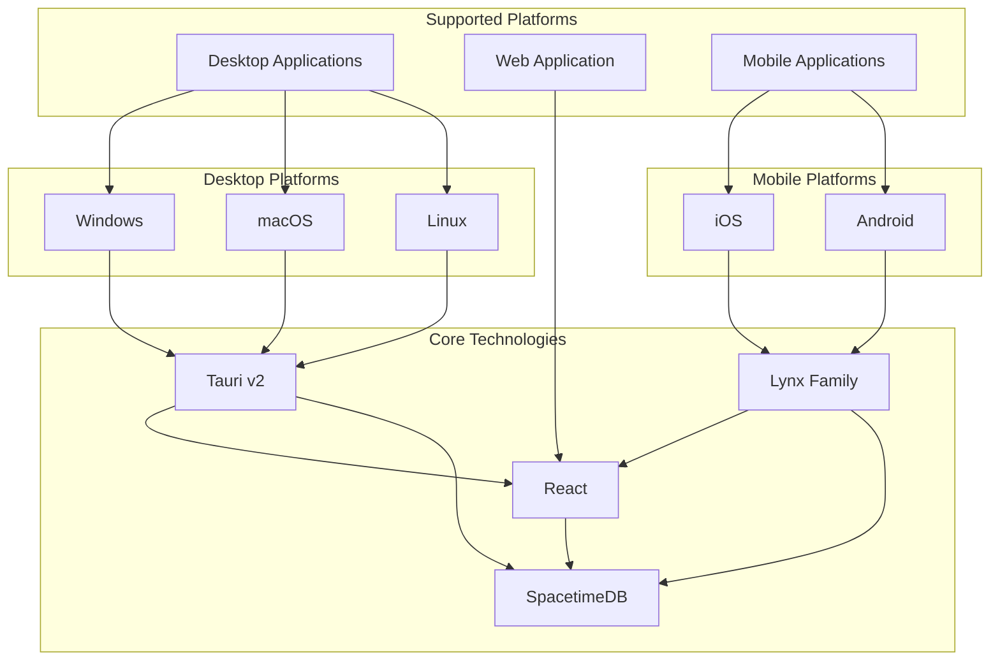
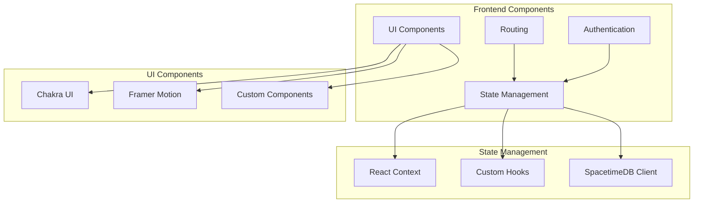
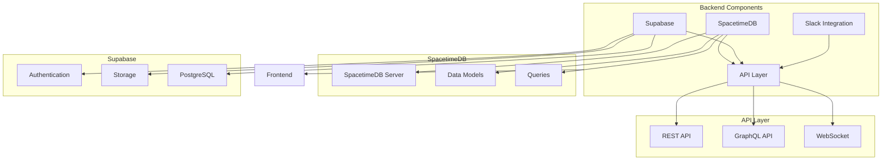
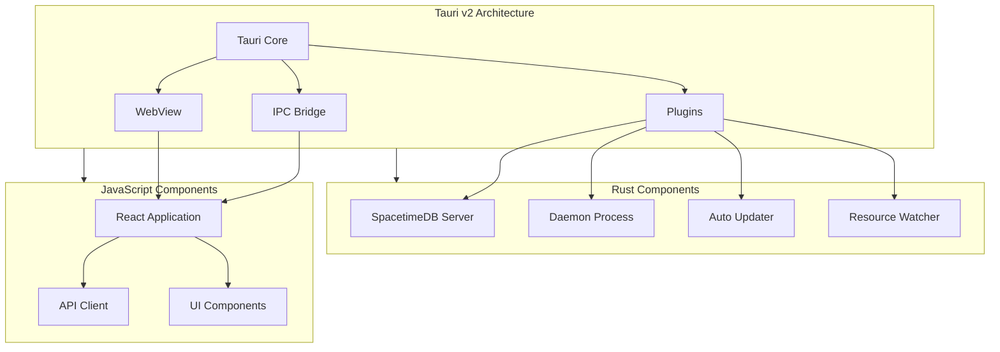
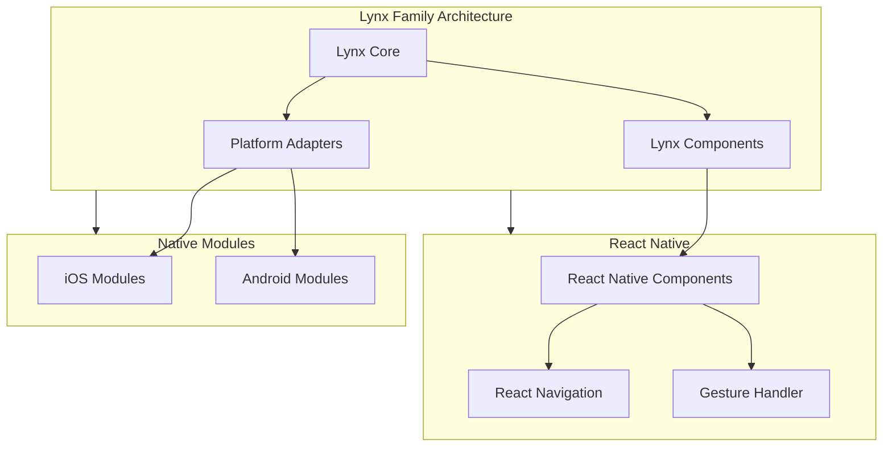
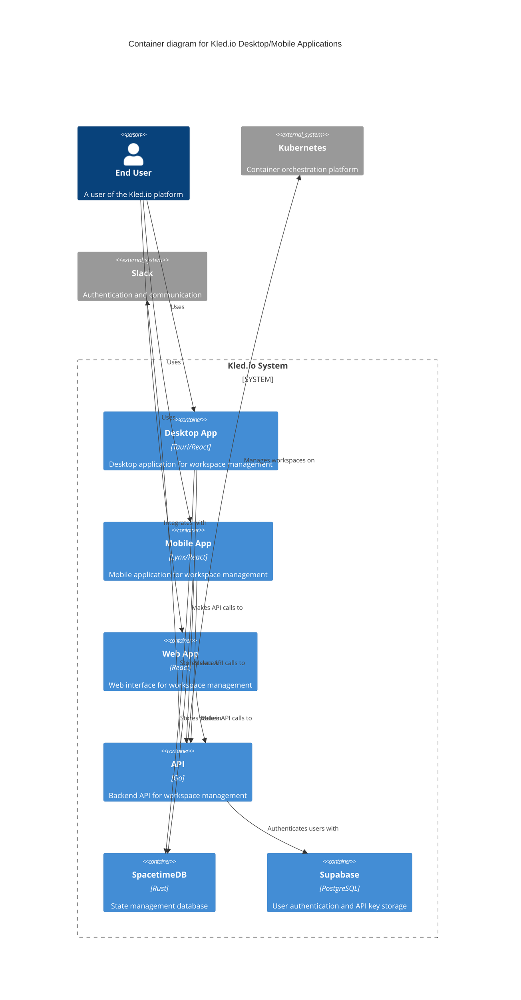
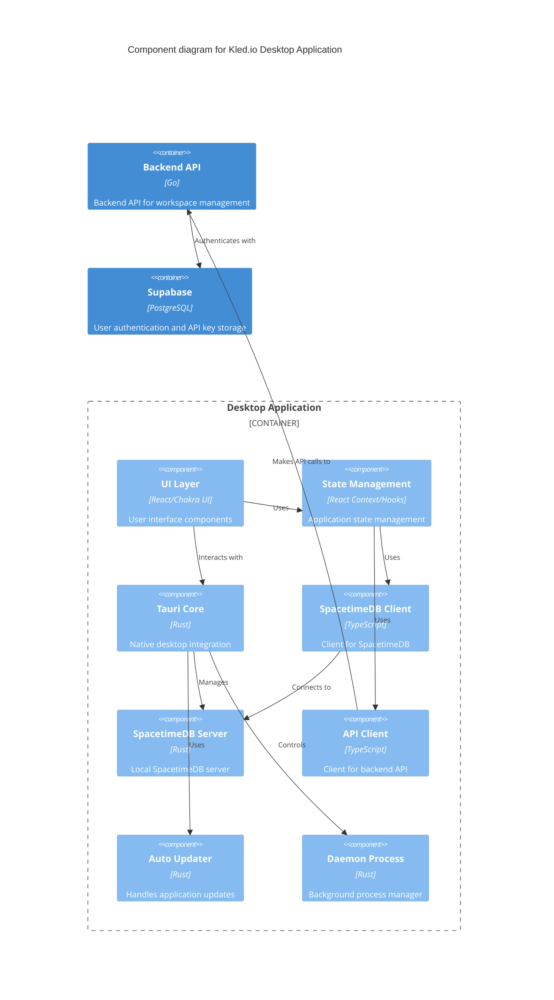

# Desktop and Mobile Application Architecture

## Overview

The Kled.io desktop and mobile application architecture describes the structure and components of the multi-platform applications. This document outlines the frontend and backend components, state management, and cross-platform integration.

## Platform Architecture



## Frontend Architecture



## Backend Architecture



## Tauri v2 Architecture



## Lynx Family Architecture for Mobile



## C4 Model: Container Level



## C4 Model: Component Level for Desktop App



## Implementation Details

### Desktop Application (Tauri v2)

The desktop application is built using Tauri v2, which provides a lightweight framework for building desktop applications with web technologies. The application consists of:

1. **Frontend**: React application with Chakra UI components
2. **Backend**: Rust-based Tauri application with SpacetimeDB server

```rust
// Main Tauri application entry point
fn main() {
    tauri::Builder::default()
        .plugin(tauri_plugin_shell::init())
        .plugin(tauri_plugin_dialog::init())
        .plugin(tauri_plugin_fs::init())
        .plugin(tauri_plugin_http::init())
        .plugin(tauri_plugin_updater::init())
        .setup(|app| {
            // Initialize SpacetimeDB server
            let spacetime_server = SpacetimeServer::new(app.handle().clone());
            app.manage(spacetime_server);
            
            // Start daemon process
            let daemon = Daemon::new(app.handle().clone());
            app.manage(daemon);
            
            Ok(())
        })
        .run(tauri::generate_context!())
        .expect("error while running tauri application");
}
```

### Mobile Application (Lynx Family)

The mobile application is built using the Lynx Family framework, which provides a cross-platform solution for building mobile applications with React:

```javascript
// Mobile application entry point
import { LynxApp } from '@lynx/core';
import { ThemeProvider } from '@chakra-ui/react';
import { SpacetimeProvider } from './spacetime';
import { ApiProvider } from './api';
import App from './App';

export default function Main() {
  return (
    <LynxApp>
      <ThemeProvider>
        <SpacetimeProvider>
          <ApiProvider>
            <App />
          </ApiProvider>
        </SpacetimeProvider>
      </ThemeProvider>
    </LynxApp>
  );
}
```

### SpacetimeDB Integration

SpacetimeDB is used for state management across all platforms:

```typescript
// SpacetimeDB client integration
import { SpacetimeDBClient } from '@spacetimedb/client';

export function useSpacetime() {
  const [client, setClient] = useState<SpacetimeDBClient | null>(null);
  
  useEffect(() => {
    const initSpacetime = async () => {
      const client = new SpacetimeDBClient({
        uri: 'http://localhost:3000',
        authToken: localStorage.getItem('authToken'),
      });
      
      await client.connect();
      setClient(client);
    };
    
    initSpacetime();
    
    return () => {
      client?.disconnect();
    };
  }, []);
  
  return client;
}
```

## Conclusion

The desktop and mobile application architecture provides a unified approach to building cross-platform applications while leveraging platform-specific capabilities. The use of SpacetimeDB for state management ensures consistency across all platforms, while the integration with Supabase provides robust authentication and storage capabilities.
