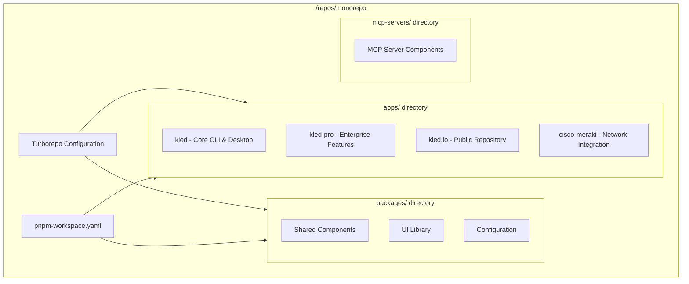
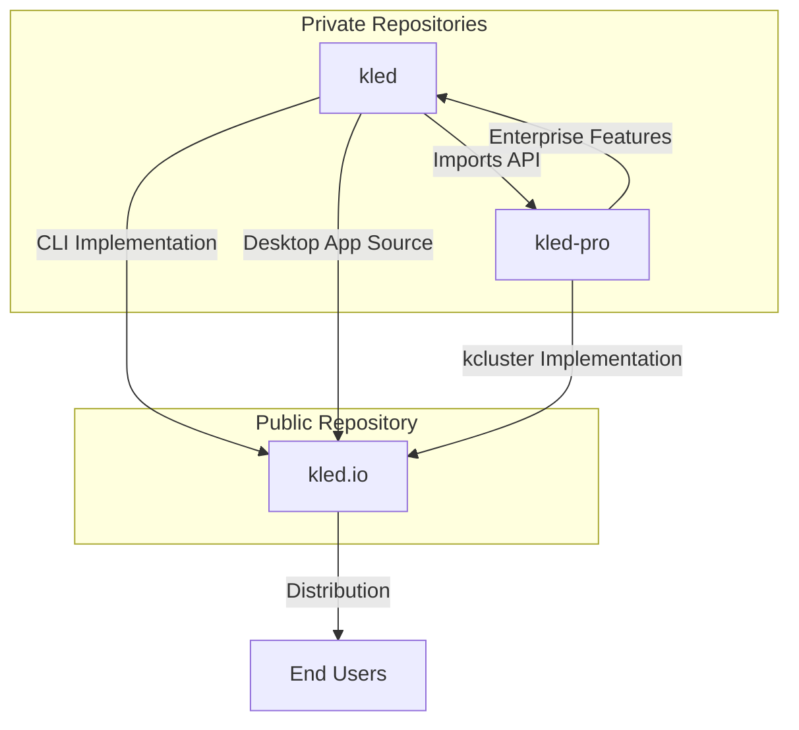
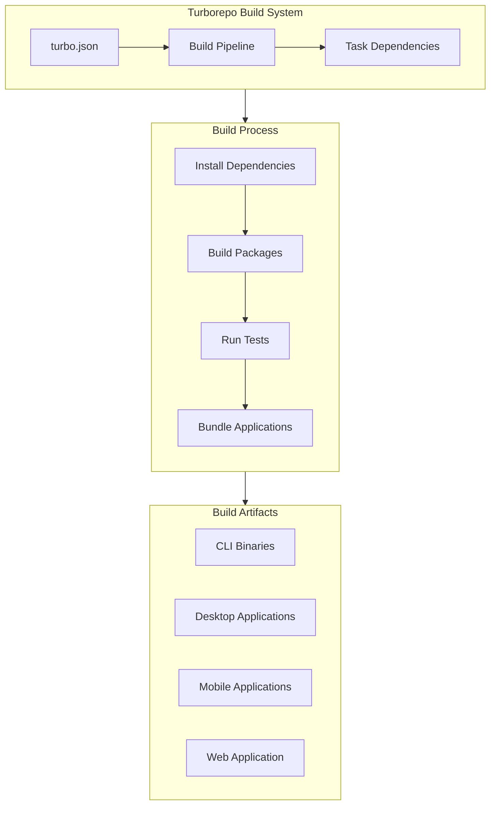
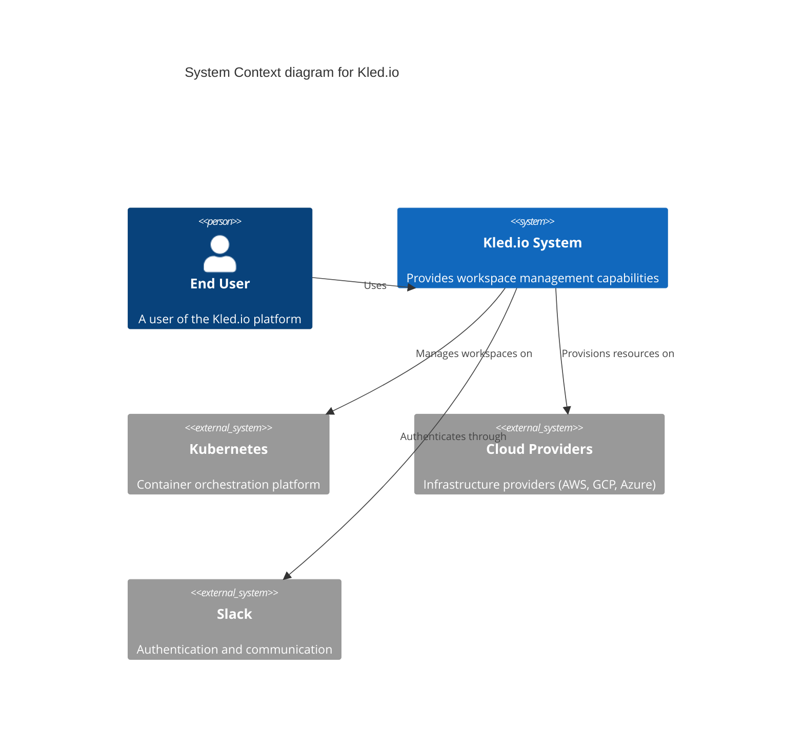
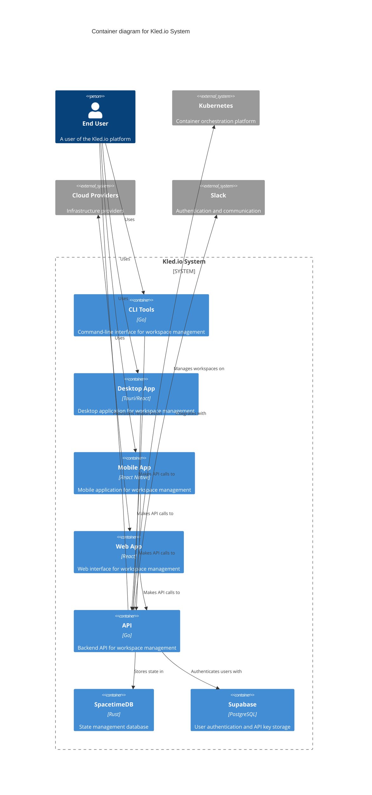

# Kled.io Monorepo Architecture

## Overview

The Kled.io monorepo is structured to support a unified development environment for multiple related projects while maintaining separation of concerns. This document outlines the high-level architecture of the monorepo, the relationships between its components, and the build system flow.

## Monorepo Structure

### Key Components

1. **apps/** - Contains the main application repositories:
   - **kled/** - Core CLI and desktop application (private repository)
   - **kled-pro/** - Enterprise features and extensions (private repository)
   - **kled.io/** - Public-facing repository for distribution
   - **cisco-meraki/** - Network integration components

2. **packages/** - Contains shared libraries and components:
   - Shared UI components
   - Configuration utilities
   - Common types and interfaces

3. **mcp-servers/** - Contains server components placed at the monorepo root

## Repository Relationships

### Integration Points

1. **CLI Commands**:
   - `kled` commands implemented in the private kled repository
   - `kcluster` commands implemented in the private kled-pro repository
   - Unified CLI distributed through the public kled.io repository

2. **API Integration**:
   - kled-pro/platform provides API implementation
   - kled imports API from kled-pro/platform instead of github.com/loft-sh/api/v4

3. **Desktop Application**:
   - Source code in private kled repository
   - Built applications distributed through public kled.io repository

## Build System Flow

### Build Order

1. Install dependencies (yarn install)
2. Build shared packages
3. Build applications in dependency order:
   - SpacetimeDB server component first
   - Then desktop application components
   - CLI components
   - Web and mobile components

## C4 Model: Context Level

## C4 Model: Container Level

## Conclusion

The Kled.io monorepo architecture is designed to support a multi-platform application ecosystem with shared components and a unified build system. The separation between public and private repositories allows for open-source distribution while protecting proprietary code.
