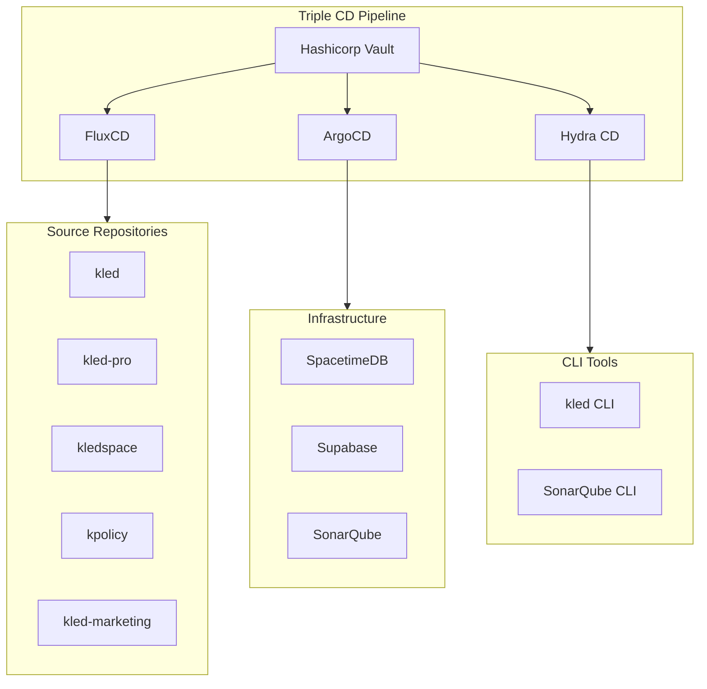

# Triple CD Pipeline Architecture

## Overview

The Kled.io Triple CD Pipeline provides a comprehensive approach to continuous delivery across different aspects of the system:

1. **FluxCD** - Manages code from private repositories
2. **ArgoCD** - Manages infrastructure components
3. **Hydra CD** - Manages Go CLI code and integrations

This document outlines the architecture, components, and workflows of the triple CD pipeline.

## Pipeline Components

## FluxCD Configuration

FluxCD is responsible for syncing code from private repositories to ensure all components are up-to-date.

### Key Components

- **GitRepository**: Defines the source repositories to monitor
- **Kustomization**: Defines how to apply the Kubernetes manifests
- **Vault Integration**: Securely manages access to private repositories

## ArgoCD Configuration

ArgoCD manages the deployment and configuration of infrastructure components.

### Key Components

- **Application**: Defines the applications to deploy
- **ApplicationSet**: Manages multiple related applications
- **Vault Plugin**: Securely manages secrets for deployments

## Hydra CD Configuration

Hydra CD handles the building and distribution of Go CLI code.

### Key Components

- **Jobsets**: Defines the build jobs for CLI tools
- **Nix Expressions**: Defines the build process for Go applications
- **Vault Integration**: Securely manages build secrets

## Secret Management

All secrets are managed by Hashicorp Vault, ensuring secure access across the pipeline.

### Key Features

- **Kubernetes Authentication**: Authenticates services using Kubernetes service accounts
- **Dynamic Secrets**: Generates dynamic credentials for accessing resources
- **Secret Rotation**: Automatically rotates secrets based on policies

## Workflow Examples

### Updating a Private Repository

1. Developer commits changes to a private repository
2. FluxCD detects the changes and syncs the code
3. ArgoCD deploys updated infrastructure components
4. Hydra CD builds updated CLI tools
5. End users can access the updated functionality

### Adding a New Integration

1. Developer adds a new integration (e.g., SonarQube)
2. ArgoCD deploys the new infrastructure component
3. Hydra CD builds the CLI tools with the new integration
4. FluxCD ensures all repositories are updated with the integration
5. End users can access the new integration through the CLI
